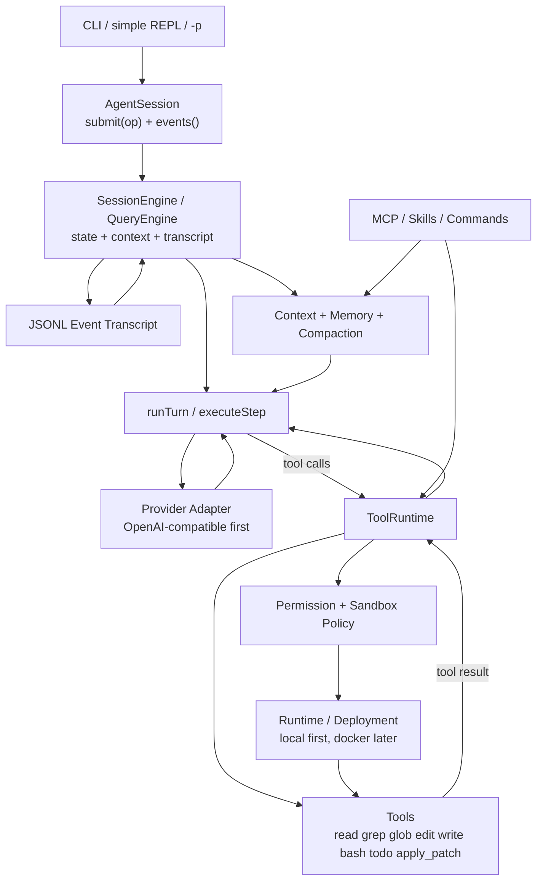

# light-cc-coder 决策版实现计划

本文档是后续实现的权威计划。它不是参考资料列表，而是已经筛选后的架构决策和分阶段交付边界。

## 0. 总目标

实现一个轻量、快速、可真实使用的 TypeScript Claude Code 风格 coder harness。

核心形态：



## 1. Non-negotiable 不变量

第一版必须保证：

- 每个 model tool call 都有 exactly one paired tool result，除非 turn 在结果记录前被明确中断。
- tool result 以模型可理解的结构回灌，工具错误、权限拒绝、超时、sandbox denied 都不能只停留在 UI。
- `runTurn` 不直接读写 UI 状态；UI 只通过 `submit(op)` 和事件流互动。
- 文件写入默认限制在 workspace root 内，并处理 symlink/path traversal。
- shell 默认有 timeout、cwd、env、output truncation、kill process group。
- context 不无限增长：至少有 tool output snip 和 manual compact；后续有自动 compact。
- session 可 trace、可 replay、可 resume；JSONL event transcript 是持久化基线。
- prompt/cache 尽量稳定：system prompt、tool schema、memory 注入顺序稳定；正常 turn 只 append。

## 2. 已定模块边界

### 2.1 Core: AgentSession

职责：

- 暴露 `submit(op): Promise<void>`。
- 暴露事件流，最初可用 `EventEmitter` 或 async iterator。
- 管理 active turn、interrupt、approval response、compact request、shutdown。
- 不直接实现 model call、tool execution、filesystem operation。

采用 Codex 的核心接口思想：`Core = submit(Op) + nextEvent()`。第一版不做 app-server/JSON-RPC，先同进程内存实现。

事件最小集合：

- `session.started`
- `turn.started`
- `step.started`
- `assistant.delta`
- `assistant.message`
- `tool.call`
- `tool.result`
- `approval.requested`
- `step.ended`
- `turn.ended`
- `compact.started`
- `compact.ended`
- `error`

### 2.2 SessionEngine / QueryEngine

职责：

- session id、turn id、message history、tool state、memory state。
- 将 transcript/event log 投影成 provider messages。
- 每个 step 前通过 ContextAssembler 组装 provider request context：system prompt、runtime facts、AGENTS.md、memory/git/skills/MCP 插槽、tools schema、history projection。
- 调用 `runTurn`，处理 provider retry、context overflow、compact retry、resume。
- 写 JSONL transcript。

边界：

- 不直接执行工具。
- 不直接审批权限。
- 不把 CLI/TUI 的展示结构塞进 messages。

### 2.3 Agent Loop

核心伪代码：

```ts
async function runTurn(input) {
  appendUserMessage(input)
  for step in 1..maxSteps {
    const messages = await buildMessages()
    const response = await model.stream({ messages, tools })
    appendAssistantMessage(response)
    if (response.toolCalls.length === 0) return endTurn(response.stopReason)
    const toolResults = await toolRuntime.runBatch(response.toolCalls)
    appendToolResults(toolResults)
    maybeCompactBeforeNextStep()
  }
  return pauseWithMaxSteps()
}
```

模型是否继续由实际 `toolCalls.length` 决定，不只信 `finish_reason`。

### 2.4 Provider Adapter

Phase 1 已落地 minimal OpenAI-compatible streaming adapter，用于驱动文件型 coder
闭环。Phase 2 不重新实现 provider，而是审计 provider request assembly 与 context
source 边界，确保后续 memory/skills/MCP 注入不会污染 loop 或破坏 replay。

接口：

```ts
interface Provider {
  stream(input: ProviderRequest, signal: AbortSignal): AsyncIterable<ModelEvent>
}
```

职责：

- 归一化 text delta、reasoning delta、tool call delta、final tool calls、usage、finish reason。
- 解析 streaming tool call arguments。
- 保留 provider raw metadata 到 transcript diagnostics，不污染 model-visible messages。

不做：

- 多 provider SDK 深集成。
- Anthropic native special headers。
- prompt cache control 特化。后续再加。

### 2.5 ToolRuntime

职责：

- 查 tool。
- JSON/schema validation。
- 准备 display/description。
- 调 workspace/file safety policy；Phase 3 接入完整 permission/sandbox policy。
- 调 tool execute。
- output truncation。
- 将异常、拒绝、超时转为 `ToolResult`。
- 按 provider order 记录 `tool.result`。

调度：

- Phase 1：all read-only 批次并发；任何 writer/apply_patch 出现则整个 batch 串行。
- Phase 3：`bash` 接入后仍保守串行，受 permission/sandbox policy 约束。
- 后续 hardening：升级为 resource-aware scheduler。

工具接口：

```ts
interface Tool<Input = unknown> {
  name: string
  description: string
  inputSchema: unknown
  readOnly: boolean
  approvalRule?(input: Input): string
  accesses?(input: Input): ToolAccesses
  execute(input: Input, ctx: ToolContext): Promise<ToolResult>
}
```

### 2.6 Runtime / Deployment

采用 SWE-ReX 的窄接口思想，但做 TypeScript 子集。

接口：

```ts
interface Runtime {
  isAlive(): Promise<boolean>
  createSession(name: string, opts?: RuntimeSessionOptions): Promise<void>
  runInSession(name: string, command: ShellCommand): Promise<ShellObservation>
  execute(command: ShellCommand): Promise<ShellObservation>
  readFile(path: string): Promise<string>
  writeFile(path: string, content: string): Promise<void>
  closeSession(name: string): Promise<void>
  close(): Promise<void>
}
```

Phase 3：

- `LocalRuntime`：本机执行，受 permission/workspace boundary 管控。
- `LocalDeployment`：启动和关闭 runtime，实际只是创建对象。

后续：

- `DockerDeployment`：容器隔离，runtime server 或 mounted workspace。

边界：

- agent loop 不直接使用 `child_process`。
- shell/file tools 通过 runtime 或 workspace fs adapter。

### 2.7 Permission / Sandbox / Safety

MVP 权限模型：

- `read-only`：只允许 read/grep/glob/todo。
- `workspace-write`：允许 workspace 内文件写入，bash 需要 ask 或 allow rule。
- `danger-full-access`：跳过提示，但仍记录审计事件。

Policy：

- `allow` / `ask` / `deny`。
- deny 优先级最高。
- subject 从 args 提取：`command`、`path`、`file_path`、`pattern`。
- approval 用 pending promise：tool runtime 发 `approval.requested`，CLI/REPL 回 `approval.responded`。

Safety：

- sensitive paths hard deny：`.env`、private keys、SSH keys、credentials 等。
- workspace write boundary 默认开启。
- shell denylist 默认开启：`rm -rf /`、`git reset --hard`、`git push`、disk formatting、curl pipe shell 等。
- apply patch/write/edit 走同一套 file write policy。

### 2.8 Tools

内置工具分阶段接入：

- Phase 1 file tools：
  - `read`：读文本文件，line numbers，offset/limit，大文件保护。
  - `grep`：调用系统 `rg`，遵守 `.gitignore`，限制结果数。
  - `glob`：文件发现，稳定排序，限制结果数。
  - `edit`：exact `oldText -> newText`，要求唯一匹配，返回 unified diff。
  - `write`：新建/整体覆盖，受写边界保护。
  - `apply_patch`：专门 patch 工具，parse/validate 后再写文件。
- Phase 3 shell/verification：
  - `bash`：命令执行，timeout，stdout/stderr capture，head/tail truncation，exit code。
- Phase 5 extension/usability：
  - `todo`：轻量任务状态，只影响 session，不碰文件。

编辑决策：

- 第一版主编辑面是 `edit` exact replace 和 `apply_patch`。
- Aider 的 SEARCH/REPLACE 作为后续优化输入格式，不作为第一版主协议。
- 对 patch/apply/edit 维护 turn 内 committed delta，UI diff 不只依赖 `git diff`。

### 2.9 Context / Memory / Compaction

Context 组成：

- Stable system prompt：固定行为规则、工具使用原则、输出风格。
- Runtime context：cwd、OS、date、git status、permission mode。
- Project context：AGENTS.md，后续支持多层发现。
- Memory：Phase 4 不作为主线；后续只做显式 memory 文件，不自动写隐式长期记忆。
- Skills：被启用 skill 的简短说明和具体指令。
- History projection：从 transcript 投影出的 provider messages。

压缩：

- Phase 1：ToolRuntime 层做 tool result output cap，避免单次结果炸上下文。
- Phase 1 已落地 minimal ContextBuilder 作为真实 provider 支撑面；它只是能跑通 `AGENTS.md` 的 shim，不是最终 Context Engineering。
- Phase 2：把 minimal ContextBuilder 升级为真正的 Context Assembly 层，接回 SessionEngine，明确 source ownership、稳定注入顺序、context snapshot/replay/debug、后续 memory/skills/MCP 插槽。
- Phase 4：compact-first context management。先做 large tool result artifact preview、history tool output snip、manual compact checkpoint、auto compact threshold、context overflow compact/retry。Memory 可以继续为空；git context 只做可选的小快照，不阻塞 compact 闭环。
- compact 摘要必须保留：任务目标、已改文件、关键决策、失败命令、当前下一步。
- compact 不能产生 orphan tool result；recent tail 边界要对齐 assistant/tool pairing。
- compact 不能等到 provider hard limit 才触发；summary compact 自身需要预留输入/输出 buffer。

### 2.10 MCP / Skills / Commands

Phase 5 薄实现：

- MCP stdio only。
- MCP tools 命名空间化，比如 `mcp__server__tool`。
- MCP tools 注册进 ToolRuntime，必须走同一权限系统。
- Skills 读取 `SKILL.md`，手动启用或简单关键字触发，注入 context。
- Slash commands：`/help`、`/clear`、`/compact`、`/memory`、`/tools`、`/permissions`。

不做：

- OAuth。
- 插件市场。
- skill assets/scripts 自动复杂执行。

## 3. 目录规划

```text
src/
  core/
    AgentSession.ts
    events.ts
    ops.ts
  engine/
    SessionEngine.ts
    contextBuilder.ts
    messageProjection.ts
    transcript.ts
  loop/
    runTurn.ts
    executeStep.ts
    modelEvents.ts
  providers/
    openaiCompatible.ts
    types.ts
  tools/
    ToolRuntime.ts
    registry.ts
    builtins/
      read.ts
      grep.ts
      glob.ts
      edit.ts
      write.ts
      applyPatch.ts
      bash.ts
      todo.ts
  workspace/
    pathBoundary.ts
    WorkspaceFs.ts
  runtime/
    Runtime.ts
    LocalRuntime.ts
    Deployment.ts
  permissions/
    policy.ts
    approval.ts
    shellPolicy.ts
  context/
    agentsMd.ts
    memory.ts
    compaction.ts
    gitContext.ts
  extensions/
    mcp.ts
    skills.ts
    commands.ts
  cli/
    main.ts
    repl.ts
test/
  loop/
  tools/
  permissions/
  transcript/
```

## 4. Phases

### Phase 0: 核心骨架

Spec: [`Spec/phase-0.md`](../Spec/phase-0.md)

Status: implemented. Verification: `bun run test` and `bun run typecheck`.

定位：Phase 0 是 kernel milestone，不是可用 coder。它只证明 loop、tool/result pairing、事件流、transcript/replay 等核心不变量；真实文件工具、shell、权限、sandbox 从后续 phase 接入。

交付：

- TypeScript package scaffold。
- `AgentSession.submit(op)` + async event stream。
- JSONL transcript writer。
- fake provider。
- `runTurn` / `executeStep`。
- fake tool runtime。

测试：

- text-only turn completes。
- one tool call leads to one tool result and second model step。
- malformed tool call becomes error result。
- multiple tool calls produce ordered paired results。
- unknown tool / tool exception become error results。
- maxSteps pairs final tool calls before ending。
- abort cannot leave orphan tool calls。
- transcript replay recreates provider messages。
- active turn guard rejects concurrent user submit。

完成标准：

- 不接真实模型也能用 fake provider 完整 replay 一次 tool turn。

### Phase 1: Tool Runtime / File Tools

Spec: [`Spec/phase-1.md`](../Spec/phase-1.md)

Status: implemented. Verification: `bun run test` and `bun run typecheck`.

定位：Phase 1 原本主线是打牢真实 ToolRuntime 和 workspace-scoped 文件工具。并行实现已经顺带落地了 minimal real-provider/context/headless entry，用作文件工具链路的真实驱动面。后续仍把深度 Context Engineering 单独放在 Phase 2 审计和加固，不继续把新 context 能力塞回 Phase 1。

交付：

- `ToolRegistry` 和 OpenAI-compatible tool schema export。
- `ToolRuntime`：lookup、input parse/validation、error-to-result、output truncation、provider-order result normalization。
- `read`、`grep`、`glob`、`edit`、`write`、`apply_patch`。
- workspace path boundary：path traversal、absolute outside、symlink escape、新文件 deepest existing ancestor。
- sensitive path hard deny：`.env`、private keys、SSH/cloud/kube/docker credentials。
- read-only batch concurrency；writer/apply_patch serial。
- OpenAI-compatible provider streaming adapter。
- minimal context prefix：stable system prompt、workspace facts、root `AGENTS.md`、tool schemas、projected history。
- simple `-p` CLI smoke。

测试：

- Phase 0 regression 全部通过。
- unknown tool / invalid input / tool exception 都返回 exactly one error result。
- read-only batch 可并发但结果保持 provider order。
- writer 出现时整批串行。
- read before edit workflow with `FakeProvider + real ToolRuntime`。
- edit duplicate/missing oldText fails without writing。
- write outside workspace / sensitive path denied without writing。
- apply_patch malformed/conflict/outside workspace fails without partial write。
- transcript replay recreates valid provider messages。
- provider mock SSE：text delta、tool call delta、multiple interleaved tool calls、malformed JSON。
- root `AGENTS.md` missing/oversized cases。
- `-p` smoke with fake/mock provider，不依赖真实网络。

完成标准：

- 用 `FakeProvider` 触发真实 ToolRuntime，在 temp workspace 中读、搜、改、写、patch，并保持 Phase 0 pairing/transcript/replay 不变量。
- 能用 real OpenAI-compatible provider adapter 手动驱动文件型 coder 的基础链路。

### Phase 2: Context Assembly / Context Engineering

Status: implemented. Verification: `bun run test` and `bun run typecheck`.

定位：Phase 2 专门实现真正的 Context Assembly 层。Phase 1 已经落地 minimal ContextBuilder/provider/`-p`，但这只是可运行闭环；Phase 2 要把 context 组装从 `AgentSession.start()` 的临时拼接，提升为 SessionEngine 拥有、独立模块实现、可 trace/replay/debug 的核心能力。

交付：

- `ContextAssembler` 模块：明确 stable prefix、runtime facts、project context、tool schemas、history projection 的 ownership。
- `SessionEngine` owns context assembly：`AgentSession` 不再直接加载和拼接 `AGENTS.md`。
- context snapshot / provider request trace 完整化，便于 replay/debug。
- prompt/cache stability audit：system prompt、tool schema、AGENTS.md、runtime facts 的顺序稳定。
- root `AGENTS.md` 行为加固：size cap、缺失、截断、后续多层发现的兼容设计。
- context source slots：为 Phase 4 memory/git/compact 和 Phase 5 skills/MCP 预留稳定接口，但不实现它们。
- provider request assembly 从 loop 中保持解耦，`runTurn` 仍不直接拼 context。

测试：

- context request order stable。
- context snapshot can reconstruct provider request prefix。
- AGENTS.md changes after transcript do not make old transcript ambiguous。
- tool schemas remain stable across repeated builds。
- transcript replay 仍只从 `user.message`、`assistant.message`、`tool.result` 重建 model history。

完成标准：

- 能清楚解释一次 provider request 的 context prefix 来自哪些 source、顺序为何、如何 replay/debug，并为后续 memory/skills/MCP 注入保留稳定接口。

### Phase 3: Shell、权限、验证

Status: implemented. Verification: `bun run test` and `bun run typecheck`.

交付：

- `bash` through `LocalRuntime`。
- timeout、kill process group、stdout/stderr capture、output truncation。
- permission modes：read-only、workspace-write、danger-full-access。
- approval event + response。
- shell denylist/allowlist。
- 修改代码后运行测试命令的最小 verification workflow。

测试：

- denied shell returns tool result。
- timeout returns tool result and kills process。
- user approval allow/deny paths。
- dangerous commands denied or ask。
- workspace-write permits file tools but gates bash。
- verification command output is truncated and replay-safe。

完成标准：

- 能修改代码后运行测试命令；危险命令不会直接执行。

### Phase 4: Compact-first Context Management

Status: implemented. Verification: `bun run test` and `bun run typecheck`.

交付：

- large tool result artifact preview：超大工具结果落到 session artifact，模型只看 bounded preview。
- history tool output snip：旧的大型 tool result 在 provider projection 中被 snip，transcript 原文保留。
- manual compact checkpoint：`compact.request` 生成 summary + pairing-safe recent tail。
- auto compact threshold：在 provider hard limit 前主动 compact，默认 `maxContextTokens` 可按 200K 设计。
- context overflow compact/retry：provider 报 context too large 后只 compact/retry 一次。
- memory 非主线，可继续为空；git context 只做可选 session-start 小快照。

测试：

- large tool result has exactly one paired preview result and an artifact diagnostic.
- long historical tool output is snipped in projection without mutating transcript.
- compact keeps recent valid assistant/tool pairing.
- compact summary/checkpoint is persisted as append-only events.
- auto compact triggers before the hard threshold.
- replay after compact remains valid.

完成标准：

- 长任务不会因为上下文增长直接失控，session 可恢复。

### Phase 5: MCP、Skills、Commands

Status: minimal closed loop implemented. Verification: `bun run test` and `bun run typecheck`.

交付：

- MCP stdio client，显式配置，不自动发现 `.mcp.json`。
- MCP tool registration and namespacing，统一进入 `ToolRuntime`。
- explicit `SKILL.md` skill loader and `skills_slot` context injection。
- built-in slash commands。
- typed minimal hooks：user prompt submit、pre tool、post tool、stop。
- `todo` session tool and bounded `todo_slot` context。

测试：

- MCP tool result pairs correctly。
- MCP tool goes through permission。
- skill injects prompt deterministically。
- slash command does not pollute model history unless intended。

完成标准：

- 最小扩展面可用，但不扩大核心 loop。

### Phase 6: Dogfood Hardening

Spec: [`Spec/phase-6.md`](../Spec/phase-6.md)

Status: minimal closed loop implemented. Verification: `bun run test` and `bun run typecheck`.

定位：Phase 6 不是产品入口，也不是性能 profiling。它只加固内核 dogfood
体验：一次真实中小仓库任务完成后，用户和模型都能更清楚地判断“改了什么、
为什么执行这个工具、验证结果如何、失败后怎么继续”。这些能力必须继续走
现有 `ToolRuntime`、`ContextAssembler`、JSONL transcript 和 replay-safe
diagnostic 边界。

已交付最小闭环：

- `git_feedback` read-only builtin tool：通过 `ToolRuntime` 注册和执行；read-only
  mode 可用，workspace-write 不需要 approval；返回 non-git、branch/HEAD、dirty
  files、staged/unstaged/untracked、diff stat、bounded diff preview；固定内部 git
  inspection，不拼接模型 shell；file/byte cap；sensitive path 只报变更不展示 patch；
  不引入 git mutation。
- better approval display：`approval.requested` 带 cwd、permission mode、tool
  description、subject、policy reason、bash/tool reason、bounded input/access/risk
  summary；CLI 仍只支持 allow once / deny。risk summary 只用于展示，不参与
  `PermissionPolicy` 决策。
- provider retry and failure classification：provider step 边界在 assistant commit
  前分类；pre-delta 429/408/5xx/network/stream drop 有限 retry；abort、401/403、
  普通 4xx、context overflow、partial-delta failure 不走普通 retry；context overflow
  继续走 compact/retry；diagnostics replay-invisible。
- todo discipline hardening：`todo replace` 最多一个 `in_progress`；违反时返回 exactly
  one paired error tool result，不更新 `TodoState`，不 emit `todo.updated`。未加入
  `blocked`。
- lightweight verification ergonomics：`bash.description` 写入 `bash.observation`；
  显式/明显 verification bash 在 tool result 持久化后写 replay-invisible
  `verification.observed`，只记录命令、cwd、description、exit/status/duration 和输出
  metadata；失败输出仍通过 bash tool result 回灌模型。

后续可选但本批未做：

- host-only `/diff`。
- `turn.changed_files` diagnostic。
- transcript health scanner。

非目标：

- installable product shell、interactive REPL、session picker、config profiles。
- profiling span 系统、性能汇总命令。
- DockerDeployment、OS-level sandbox、persistent shell、background jobs。
- 完整 repo map/codegraph、resource-aware scheduler、subagents。

完成标准：

- 对一个真实小中仓库修改任务，transcript/CLI 能解释工具动作、权限决策、
  显式请求的 git 状态、验证结果和下一步风险。
- 不破坏 tool/result pairing、replay、workspace 写边界和 transcript fatal 语义。

### Phase 7: Product Shell / Minimal Entry

Spec: [`Spec/phase-7.md`](../Spec/phase-7.md)

Status: minimal closed loop implemented. Verification: `bun run test` and `bun run typecheck`.

定位：Phase 7 把 light-cc-coder 从“可运行 harness”变成“别人能顺手打开使用的
小 coder”。核心不是全屏复杂 TUI，而是最小产品入口：安装后一个命令启动、
默认可交互、状态清楚、配置失败可诊断、session 可找回。

已交付最小闭环：

- installable bin aliases：`lightcc`、`light-cc`、`light-cc-coder`；npm package
  入口构建为 Node.js `dist/main.js`，发布后目标安装方式是
  `npm install -g light-cc-coder`，不要求用户 clone 源码。
- `-p` one-shot 保持兼容；无 `-p` 且 TTY 默认进入 line-oriented REPL。
- CLI product layer：args、config、session store、session factory、event renderer、
  approval prompt、REPL、doctor 拆出，`main.ts` 保持薄入口。
- 默认 transcript/session store：`~/.lightcc/sessions/<session-id>/transcript.jsonl`、
  `metadata.json`、`session_index.jsonl`；`LIGHTCC_HOME` 可覆盖；`--transcript`
  仍可 override。
- config layering：defaults < global config < project config < env < CLI flags，
  effective values 带 source，用于 `/config` 和 doctor；API key 从 env 读取。
- `doctor` / `--dry-run`：不发模型请求、不执行 agent tools、不写普通 transcript。
- resume：从 canonical transcript replay 恢复 active messages，保留 pairing 校验；
  `resume --last` / `resume <id>` 拒绝不同 cwd session。
- product slash commands：`/help`、`/status`、`/config`、`/context`、`/diff`、
  `/tools`、`/permissions`、`/compact`、`/sessions`、`/resume`、`/clear`、
  `/quit`、`/exit`，默认 replay-invisible。
- REPL：多轮同一 `AgentSession`，通过 `submit(op)` 和 `events()` 交互，支持
  streaming assistant output、tool status、approval prompt 和基础 Ctrl-C/Ctrl-D 退出语义。

非目标：

- 全屏 TUI、复杂键位系统、IDE integration。
- 持久 trust rule、OAuth/login、插件市场。
- rollback/fork、persistent shell/background tasks。

后续可选但本批未做：

- public `--json` automation stream。
- full-screen TUI / setup wizard / OAuth。
- host-only `/diff` 的真实 changed-files 数据源；当前没有 Phase 6 turn delta 时只报告 unavailable。
- 完整 session picker/search/rename/archive/export。

完成标准：

- 新用户完成安装和 provider 配置后，可以用一个命令进入连续对话式 coder；
  常见配置错误能通过 `doctor` 定位；不需要理解内部 harness 参数。

### Phase 8: Profiling / Performance Observability

Spec: [`Spec/phase-8.md`](../Spec/phase-8.md)

Status: planned.

定位：Phase 8 不做 benchmark/evaluation；它做系统自身 profiling。目标是拿一条
session transcript 就能判断瓶颈在 startup、context、provider、tool、approval、
MCP、compact、transcript 写入还是 runtime。

优先交付：

- replay-invisible `profile.span` diagnostic event，记录 name、phase、duration、
  parent/span id、status、关键 bounded metadata。
- provider metrics：request start、first token latency、total stream duration、
  retry count、usage/cost estimate（可用则记录）。
- context metrics：assembly、token estimate、history projection、tool schema hash、
  compact pre/post token estimate。
- tool metrics：preflight、permission、approval wait、execution、artifact/truncation、
  hooks；bash 现有 duration 纳入统一 span。
- MCP metrics：startup、tool call latency、timeout、stderr bytes。
- `lightcc profile <transcript>`：输出本地汇总，不进入 model-visible history。

非目标：

- 模型能力评测、任务成功率 benchmark、排行榜。
- 自动优化策略、模型路由、成本策略。
- 生产遥测上传。

完成标准：

- 对一次真实 session，可以本地汇总 top slow spans、provider first-token/total time、
  tool/runtime耗时、context/compact耗时，并指出下一轮优化方向。

### Phase 9: Optional OS Sandbox Backend

Spec: [`Spec/phase-9.md`](../Spec/phase-9.md)

Status: near-term minimal loop implemented; product-grade packaging remains pending.

定位：Phase 9 集成一个可选 OS-level sandbox backend，优先评估
[`@anthropic-ai/sandbox-runtime`](https://github.com/anthropic-experimental/sandbox-runtime)
作为外部依赖，而不是从零实现 sandbox。它是 defense-in-depth execution
enforcement，不替代 light-cc-coder 现有 permission policy、workspace boundary、
shell denylist 或 ToolRuntime pairing。

已交付最小闭环：

- `--os-sandbox off|auto|required` 和 `--sandbox-settings <path>` 等最小配置面。
- 近期 packaging 采用 `@anthropic-ai/sandbox-runtime` optional dependency，同时继续
  dynamic import；源码 checkout 可使用根目录 `sandbox-runtime/` submodule 的已构建
  dist 作为开发/验证 fallback。没有把 upstream 源码复制进 `src/`，也没有静态依赖。
- `sandbox-runtime/` 作为 git submodule 记录 upstream 代码，不复制其
  源码进 light-cc-coder 实现文件。
- `src/runtime/sandbox/createRuntime.ts` 在第一次 `bash` 执行时 lazy dynamic import
  `@anthropic-ai/sandbox-runtime`，只做 `SandboxManager` shape 校验和最小
  `wrapWithSandbox` / `cleanupAfterCommand` / `reset` 调用。
- 默认 `auto` 尝试动态加载 backend；显式 `off` 不加载 backend，仍走原始
  `LocalRuntime`。
- `auto` unavailable fail-open 到 `LocalRuntime` 并写 replay-invisible
  `sandbox.status`；`required` unavailable fail-closed，在 bash tool call 内返回
  paired `sandbox_unavailable` tool result。
- invalid explicit settings fail closed；sandbox denied / wrapping failure 不自动重试无
  sandbox。
- `sandbox.status` diagnostic event 不进入 `replayProviderMessages`。
- 权限拒绝和 shell hard denylist 仍在 sandbox wrapping 前发生。
- fake module 覆盖 dynamic loader unavailable、required fail-closed、active
  wrapping、cwd marker、permission/denylist ordering、session close cleanup 和 no retry without sandbox。
- `doctor --sandbox` / `--json`：检查 mode/config、backend package/submodule
  availability、platform、Linux `bwrap`/`socat`/`rg`、optional `srt` debug CLI、
  userns、AppArmor 和 seccomp helper；`off` 模式只报告 LocalRuntime 路径；不发模型请求、不写普通 transcript、不执行 agent bash。
- gated real backend E2E：依赖满足时跑 `required` sandbox session，验证 workspace
  write allowed、`$HOME` write denied、`sandbox.status active:true` 入 transcript；
  不满足时显式 skip。

Packaging 结论：

- 近期原则是“实现轻量优先，安装透明可诊断”：optional package + dynamic import +
  doctor 明确 sandbox availability/status。
- 同一原则下提供根目录 `install.sh` 作为简单 `curl | bash` 路径：只检查
  Node/npm、执行 npm global install、跑 `lightcc doctor --sandbox`；不自动安装 OS packages。
- 产品级一键安装再参考 Codex：通过 platform-specific optional resource packages
  下发 native helpers/resources，运行时优先系统 helper、必要时使用 bundled helper。
  这需要单独处理二进制来源、CI、license/update 和平台矩阵，不在 Phase 9 近期最小闭环里半套实现。
- 不在 npm `postinstall` 里 `apt install` 或修改系统依赖；也不宣称 npm 安装后 sandbox
  一定 ready。

后续可选：

- MCP stdio sandboxing 作为 Phase 9 可选第二步，必须显式启用。
- Codex-style platform optional packages / bundled resources。

非目标：

- 不宣称 sandbox 替代 approval 或 permission。
- 不做 Windows support。
- 不做 Docker/remote runtime。
- 不做 persistent shell sessions 或 background jobs。
- 不做动态网络审批循环。
- 不默认自动发现 `.srt-settings.json`，除非后续明确设计。

完成标准：

- 近期闭环完成后，即使没有 sandbox package，`bun run test` 和 `bun run typecheck`
  仍通过；`off` 显式不加载 backend；默认 `auto` 可 fail-open；fake module 可证明 unavailable、denied、
  cwd、permission ordering、tool/result pairing、transcript/replay 和
  replay-invisible diagnostics 边界；supported platform 上的 gated E2E 能证明真实 backend
  拦截 workspace 外写入并写入 active diagnostic。

### Later: High-value Deferred Capabilities

这些能力重要，但在 Phase 6-9 默认不做，除非后续明确把其中一项拉成独立 phase：

- persistent shell sessions。
- background jobs / dev server task registry。
- full repo map / codegraph。
- resource-aware scheduler。
- rollback / fork / revert-turn。
- session/project memory。
- MCP resources/prompts/auth/hot reload。
- user attachments / image/file refs / IDE selection。
- subagents / planner-executor split。

## 5. 外部参考结论固化

这些不是“以后每次都要重新看”的开放任务，而是已经固化进计划的设计取舍：

- Claude Code：主行为模型。保留 `query -> tool_use -> runTools -> tool_result -> next query` 的骨架。
- CoreCoder：只借极简 loop 心智模型和 exact edit，不借安全模型。
- Reasonix：借 prefix-cache 友好、read-only 并发、permission/sandbox 分层。
- morlay/deepseek-harness：借中文工具 prompt 和 shell/filesystem hook 的轻量思路，不依赖 Pi runtime。
- Kimi Code：借 TypeScript loop 分层、event transcript、tool lifecycle、AbortSignal、resource-aware scheduler 方向。
- openai/codex：借 `submit(Op)+events()`、approval pending promise、tool orchestrator、apply_patch 专门路径。
- SWE-ReX：借 Runtime/Deployment 窄接口和持久 shell session；云后端后置。
- CodeWhale：借 product-grade loop/context/sandbox 的边界校验，不搬 Rust/TUI。
- OpenHarness：借 QueryEngine/context/permission 的模块切分，不搬产品层。
- Aider：后续借 repo map、SEARCH/REPLACE 编辑失败反馈、git feedback loop；不作为主架构。

## 6. 近期任务板

Phase 5 最小闭环已落地。下一步转入 Phase 6，但保持小步闭环，不把产品入口、
profiling 和高风险 runtime 能力混进同一批实现：

1. Phase 6 第一个建议闭环：read-only `git_feedback` builtin 或等价 diagnostic，
   加 turn changed-files / `/diff` surface。
2. Phase 6 后续闭环：approval display、provider retry classification、todo discipline、
   lightweight verification ergonomics。
3. Phase 7 再做 installable bin、interactive REPL、default transcript/session store、
   doctor/dry-run、resume/config/status/context 命令。
4. Phase 8 再做 replay-invisible profiling spans 和本地 transcript profile 汇总。
5. Phase 9 已完成可选 OS sandbox backend 近期最小闭环；后续如继续，先做
   Codex-style platform optional resource packages 的产品级 packaging 设计。
6. persistent shell、background jobs、full repo map/codegraph、resource-aware scheduler、
   rollback/fork、memory、MCP production hardening、attachments/IDE refs、subagents
   默认放入 later backlog。
